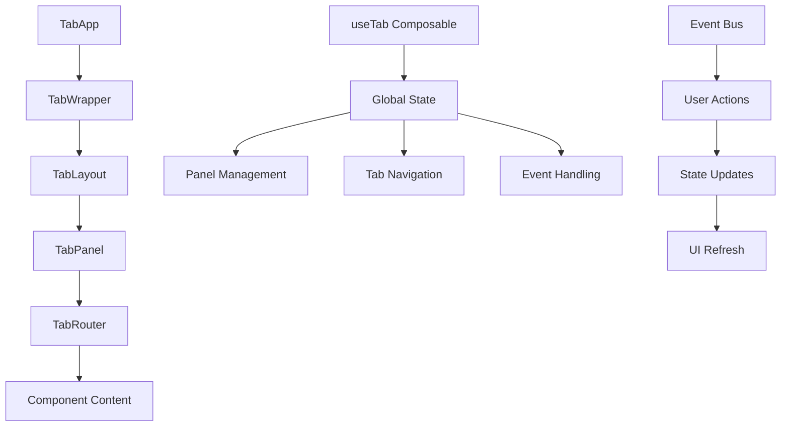

# Tabs Layer System

The tabs layer provides a sophisticated multi-document interface (MDI) system for the DocPal Node Client application. It enables users to manage multiple documents, views, and interfaces within a tabbed workspace that supports splitting, dragging, and advanced navigation.

## Overview

The tabs layer implements a complete workspace management solution with:

- **Multi-Panel Support**: Split workspace into multiple panels
- **Tab Management**: Create, close, and navigate between tabs
- **Drag & Drop Interface**: Reorganize tabs and panels through intuitive drag operations
- **History Navigation**: Back/forward navigation within tabs
- **Event Integration**: Global event bus integration for cross-component communication
- **Responsive Design**: Adaptive layout for different screen sizes
- **Keyboard Shortcuts**: Hotkey support for power users

## Architecture

### Core Components

The tabs layer is structured around several key components:

```
tabs/
├── components/tab/          # Core tab system components
│   ├── app.vue             # Main tab application container
│   ├── layout.vue          # Panel layout management
│   ├── panel.vue           # Individual panel component
│   ├── router.vue          # Tab content routing and navigation
│   ├── wrapper.vue         # Application wrapper with sidebar
│   └── pastePathDialog.vue # Path paste dialog for URL handling
├── composables/
│   └── useTab.ts           # Tab management composable
├── utils/
│   └── tabType.ts          # TypeScript type definitions
├── nuxt.config.ts          # Layer configuration
└── tsconfig.json           # TypeScript configuration
```

### Data Flow



## Key Features

### 1. Multi-Panel Workspace

The tabs system supports splitting the workspace into multiple panels:

- **Horizontal Splitting**: Create side-by-side panels
- **Dynamic Resizing**: Drag panel boundaries to resize
- **Panel Focus**: Track active panel with visual indicators
- **Responsive Layout**: Automatic adjustment for different screen sizes

### 2. Advanced Tab Management

Each panel can contain multiple tabs with:

- **Tab Creation**: Dynamically add new tabs
- **Tab Closing**: Remove tabs with keyboard shortcuts (Delete key)
- **Tab Reordering**: Drag tabs within and between panels
- **Tab States**: Track initialization and focus states

### 3. Navigation System

Built-in navigation features include:

- **History Management**: Back/forward navigation within tabs
- **Breadcrumb Support**: Visual navigation history
- **URL Handling**: Automatic detection and handling of copied URLs
- **Route Updates**: Dynamic content updates without page refresh

### 4. Drag & Drop Interface

Comprehensive drag and drop support:

- **Tab Dragging**: Move tabs between panels
- **Panel Creation**: Create new panels by dragging to edges
- **Menu Integration**: Drag menu items to create new tabs
- **Visual Feedback**: Real-time preview of drop zones

### 5. Event Integration

Global event system integration:

- **User Events**: Login/logout state changes
- **Table Events**: Zoom and interaction events
- **Copy Events**: URL clipboard detection
- **Custom Events**: Extensible event system

## Component Details

### TabApp Component

The main container component that orchestrates the entire tab system:

**Key Features:**
- Global tab state management
- Keyboard shortcut handling (Delete key for tab closing)
- Event bus integration
- Dialog management for URL pasting
- Menu sidebar integration

**Props & Events:**
- Emits: `ready`, `layoutChanged`, `highlightPanelChanged`
- Provides: Tab manager context for child components

### TabWrapper Component

Application-level wrapper that handles:

**Features:**
- Sidebar integration with menu system
- Responsive panel sizing
- Split pane management
- Storage of user preferences (panel sizes)
- Drawer integration for additional interfaces

### TabLayout Component

Manages the overall panel layout:

**Responsibilities:**
- Panel arrangement and sizing
- Split pane coordination
- Layout state management
- Responsive design adaptation

### TabPanel Component

Individual panel management:

**Features:**
- Tab header rendering
- Content area management
- Drag & drop target handling
- Focus state tracking
- Menu toggle integration (for first panel)

### TabRouter Component

Content routing and navigation within tabs:

**Capabilities:**
- Component rendering and lifecycle management
- History navigation (back/forward)
- Error boundary handling
- Message and notification systems
- Tab property updates
- Refresh functionality

## Usage Examples

### Basic Tab Creation

```typescript
// Using the tab manager
const tabManager = inject(TabManagerKey)

// Open a new tab
await tabManager?.openTab({
  name: 'document-view',
  label: 'Document View',
  icon: 'lucide:file-text',
  component: 'DocumentViewer',
  props: { documentId: '123' }
})

// Open in new panel
await tabManager?.openInNewTab({
  name: 'settings',
  label: 'Settings',
  icon: 'lucide:settings',
  component: 'SettingsView'
})
```

### Navigation Within Tabs

```typescript
// Using the menu router context
const router = inject(MenuRouterKey)

// Navigate to different content
router?.navigateTo({
  name: 'user-profile',
  label: 'User Profile',
  component: 'UserProfile',
  props: { userId: 'user-123' }
})

// Navigate back
router?.back()

// Add to history
router?.addToHistory({
  name: 'previous-view',
  label: 'Previous View'
})
```

### State Management

```typescript
// Using the tabs composable
const { layout, allComponents, initLayout } = useTabsManager()

// Initialize with custom layout
initLayout([
  {
    id: 'panel-1',
    parent: 'root',
    showingTabIndex: 0,
    tabs: [
      {
        id: 'tab-1',
        name: 'home',
        label: 'Home',
        component: 'HomePage'
      }
    ]
  }
])

// Focus specific tab
panelTabFocus('panel-1', 0)
```

## Configuration

### Layer Setup

The tabs layer is configured as a Nuxt layer:

```typescript
// nuxt.config.ts
export default defineNuxtConfig({
  devtools: { enabled: true },
  compatibilityDate: '2025-08-24',
  ssr: false, // Client-side rendering for dynamic tab management
})
```

### TypeScript Integration

Full TypeScript support with strict typing:

```typescript
interface TabItem {
  parent?: string
  initized?: boolean
  name: string
  label: string
  icon?: string
  component: string
  props?: Record<string, any>
  [key: string]: any
}

interface TabPanel {
  id: string
  size?: number
  parent: string
  showingTabIndex?: number
  tabs: TabItem[]
}
```

## Best Practices

### 1. Component Design

- **Self-Contained**: Each tab component should be independent
- **Props Interface**: Use well-defined props for component communication
- **Error Handling**: Implement error boundaries for robust UX
- **Loading States**: Provide loading feedback for async operations

### 2. State Management

- **Reactive Updates**: Use Vue's reactivity for state synchronization
- **Persistence**: Store user preferences (panel sizes, layout)
- **Cleanup**: Proper cleanup on component unmounting
- **Event Handling**: Use the global event bus for cross-tab communication

### 3. Performance

- **Lazy Loading**: Load tab content only when needed (initized flag)
- **Memory Management**: Clean up resources when tabs are closed
- **Virtual Scrolling**: For tabs with large datasets
- **Debounced Resizing**: Optimize panel resize operations

### 4. User Experience

- **Visual Feedback**: Clear indicators for active panels and tabs
- **Keyboard Navigation**: Support standard keyboard shortcuts
- **Responsive Design**: Adapt to different screen sizes
- **Accessibility**: Proper ARIA labels and keyboard navigation

## Integration Points

### Event Bus Integration

The tabs layer integrates with the global event bus system:

```typescript
import { useEventBus, EventType } from 'eventbus'

// Listen for user login events
const loginBus = useEventBus(EventType.USER_LOGIN__SUCCESS)
loginBus.on((payload) => {
  // Update tab state based on user login
})

// Handle table zoom events
const zoomBus = useEventBus(EventType.TABLE_ZOOM_MAX)
zoomBus.on(() => {
  // Adjust tab layout for maximized view
})
```

### Authentication Integration

Tabs automatically adapt to authentication state:

- **Protected Routes**: Redirect to login when authentication expires
- **User Context**: Update tab content based on user permissions
- **Session Management**: Handle session timeouts gracefully

### Menu System Integration

Deep integration with the application menu:

- **Drag & Drop**: Drag menu items to create new tabs
- **Context Menus**: Right-click options for tab management
- **Menu Toggle**: Collapsible sidebar integration

## Troubleshooting

### Common Issues

**Tab Not Loading:**
- Check if the component is properly registered
- Verify the `initized` flag is set correctly
- Ensure props are passed correctly

**Drag & Drop Not Working:**
- Verify drop zones are properly configured
- Check for conflicting event handlers
- Ensure drag data types match

**Panel Sizing Issues:**
- Check CSS grid and flexbox configurations
- Verify splitpanes integration
- Review responsive breakpoints

**State Synchronization:**
- Ensure proper use of Vue reactivity
- Check for direct state mutations
- Verify event bus subscriptions

### Debugging Tips

1. **Use Vue DevTools**: Inspect component state and props
2. **Console Logging**: Enable debug logging for state changes
3. **Event Monitoring**: Track event bus messages
4. **Performance Profiling**: Monitor for memory leaks in long-running tabs

## Migration Guide

### From Basic Tabs

If upgrading from a simpler tab system:

1. **Update Type Definitions**: Migrate to the new `TabItem` interface
2. **Event System**: Replace custom events with the global event bus
3. **State Management**: Migrate to the centralized composable system
4. **Component Structure**: Restructure components to match the layer architecture

### Breaking Changes

- **Event Names**: Updated to use `EventType` enum from eventbus
- **Component Props**: Standardized prop interfaces
- **State Structure**: New reactive state management system

## Future Enhancements

Planned improvements for the tabs layer:

- **Tab Groups**: Organize related tabs into groups
- **Workspace Presets**: Save and restore workspace layouts
- **Tab Persistence**: Restore tabs after application restart
- **Advanced Splitting**: Support for complex grid layouts
- **Plugin System**: Extensible tab functionality
- **Performance Monitoring**: Built-in performance metrics

---

*This documentation covers version 6.0.0 of the tabs layer. For the latest updates, check the layer's README file.*