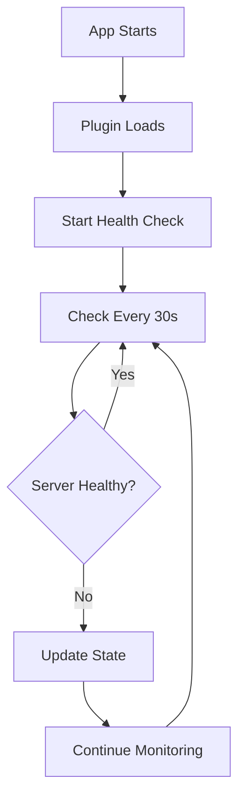
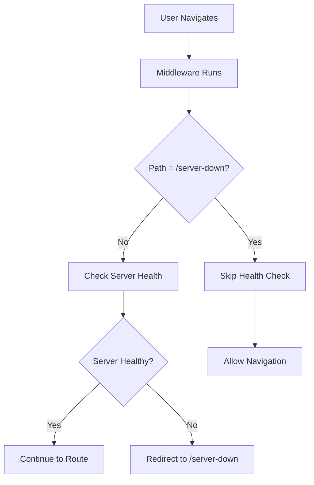
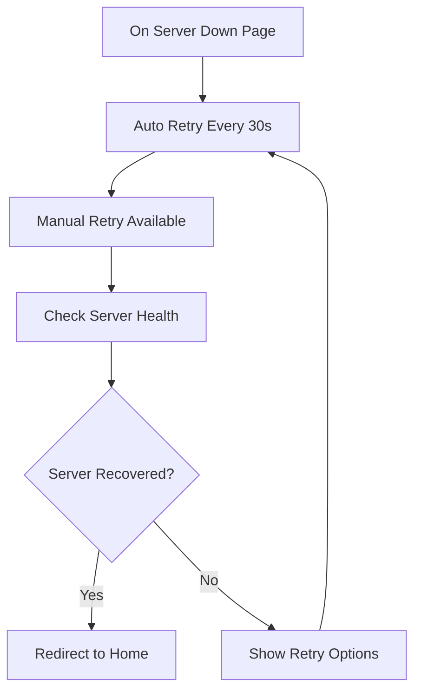

# Server Health Check System

The DocPal Node Client includes a robust server health monitoring system that automatically detects server downtime and provides a graceful user experience during outages.

## Overview

The server health check system continuously monitors the backend server status and automatically redirects users to a dedicated server-down page when the server becomes unavailable. It includes automatic recovery detection and a user-friendly interface.

### Key Features

- 🔄 **Automatic Health Monitoring** - Runs every 30 seconds in the background
- 🛡️ **Graceful Error Handling** - Users see a friendly page instead of broken functionality
- 🚀 **Auto-recovery** - Automatically redirects users back when server is restored
- ⏱️ **Configurable Timeouts** - 5-second timeout with 3 retry attempts
- 🔄 **No Infinite Redirects** - Smart routing prevents redirect loops
- 📱 **Responsive Design** - Works perfectly on desktop and mobile devices
- 🌐 **Multilingual Support** - Available in English, Chinese (Simplified), and Chinese (Traditional)

## Architecture

The system consists of four main components:

### 1. Server Health Composable

**Location**: `~/composables/serverHealth.ts`

The core composable that manages server health state and provides health check functions.

```typescript
// Global state management
export const useServerHealthy = () => useState('serverHealthy', () => true)
export const useServerHealthInit = () => useState('serverHealthInit', () => false)
export const useLastHealthCheck = () => useState('lastHealthCheck', () => 0)

// Main health check function
export async function checkServerHealth(): Promise<boolean>

// Health check with retry logic
export async function checkServerHealthWithRetry(retryAttempts = 3): Promise<boolean>

// Start/stop periodic monitoring
export function startHealthCheck()
export function stopHealthCheck()
```

### 2. Server Down Page

**Location**: `~/pages/server-down.vue`

A user-friendly error page that displays when the server is unavailable.

**Features**:
- Professional design with gradient background
- Manual retry functionality with loading states
- Auto-recovery detection and redirection
- Progress indicators during retry attempts
- Helpful user guidance and tips

### 3. Global Middleware Integration

**Location**: `~/middleware/auth.global.ts`

The authentication middleware has been enhanced to include server health checks.

```typescript
export default defineNuxtRouteMiddleware(async (to, from) => {
  // Skip health check for server-down page to prevent infinite redirects
  if (to.path === '/server-down') {
    return
  }
  
  // Check server health first
  const serverHealthy = useServerHealthy()
  const serverHealthInit = useServerHealthInit()
  
  // Perform health check if stale or not done yet
  if (!serverHealthInit.value || isHealthCheckStale()) {
    const isHealthy = await checkServerHealth()
    if (!isHealthy) {
      return navigateTo('/server-down')
    }
  }
  
  // Continue with authentication if server is healthy
  // ... auth logic
})
```

### 4. Auto-start Plugin

**Location**: `~/plugins/serverHealth.client.ts`

Automatically starts health monitoring when the application loads.

```typescript
export default defineNuxtPlugin(() => {
  if (process.client) {
    startHealthCheck()
  }
})
```

## Configuration

The system can be configured by modifying constants in the composable:

```typescript
// Health check configuration
const HEALTH_CHECK_INTERVAL = 30000 // 30 seconds
const HEALTH_CHECK_TIMEOUT = 5000   // 5 seconds
const MAX_RETRY_ATTEMPTS = 3        // Maximum retry attempts
```

### Configuration Options

| Option | Default | Description |
|--------|---------|-------------|
| `HEALTH_CHECK_INTERVAL` | 30000ms | Time between automatic health checks |
| `HEALTH_CHECK_TIMEOUT` | 5000ms | Timeout for each health check request |
| `MAX_RETRY_ATTEMPTS` | 3 | Maximum retry attempts before marking as unhealthy |

## Health Check Flow

### 1. Automatic Monitoring



### 2. Route Protection



### 3. Recovery Detection



## API Reference

### Composable Functions

#### `useServerHealthy()`

Returns reactive state indicating if the server is healthy.

```typescript
const serverHealthy = useServerHealthy()
console.log(serverHealthy.value) // true | false
```

#### `useServerHealthInit()`

Returns reactive state indicating if health check has been initialized.

```typescript
const serverHealthInit = useServerHealthInit()
console.log(serverHealthInit.value) // true | false
```

#### `checkServerHealth()`

Performs a single health check against the `/health` endpoint.

```typescript
const isHealthy = await checkServerHealth()
console.log(isHealthy) // true | false
```

#### `checkServerHealthWithRetry(retryAttempts?)`

Performs health check with retry logic.

```typescript
// Use default retry attempts (3)
const isHealthy = await checkServerHealthWithRetry()

// Custom retry attempts
const isHealthy = await checkServerHealthWithRetry(5)
```

#### `startHealthCheck()`

Starts periodic health monitoring.

```typescript
startHealthCheck()
```

#### `stopHealthCheck()`

Stops periodic health monitoring.

```typescript
stopHealthCheck()
```

#### `refreshServerHealth()`

Forces an immediate health check with retry logic.

```typescript
const isHealthy = await refreshServerHealth()
```

### State Management

The system uses Nuxt's `useState` for reactive state management:

```typescript
// Check current server health status
const serverHealthy = useServerHealthy()

// Check if health monitoring has started
const serverHealthInit = useServerHealthInit()

// Get timestamp of last health check
const lastHealthCheck = useLastHealthCheck()
```

## Internationalization

The server down page supports multiple languages:

### English (en-US)
```json
{
  "serverDown": {
    "title": "Server Temporarily Unavailable",
    "message": "We're experiencing technical difficulties. Please try again in a few moments.",
    "retry": "Try Again",
    "goHome": "Go Home"
  }
}
```

### Chinese Simplified (zh-CN)
```json
{
  "serverDown": {
    "title": "服务器暂时不可用",
    "message": "我们遇到了技术问题，请稍后再试。",
    "retry": "重试",
    "goHome": "返回主页"
  }
}
```

### Chinese Traditional (zh-HK)
```json
{
  "serverDown": {
    "title": "伺服器暫時不可用",
    "message": "我們遇到了技術問題，請稍後再試。",
    "retry": "重試",
    "goHome": "返回主頁"
  }
}
```

## Error Handling

### Health Check Failures

The system handles various failure scenarios:

1. **Network Timeouts**: 5-second timeout prevents hanging requests
2. **Server Errors**: HTTP 5xx responses are treated as unhealthy
3. **Invalid Responses**: Unexpected response formats trigger retries
4. **Connection Failures**: Network unavailability is handled gracefully

### Retry Logic

The retry mechanism uses exponential backoff:

```typescript
for (let attempt = 1; attempt <= retryAttempts; attempt++) {
  const isHealthy = await checkServerHealth()
  
  if (isHealthy) {
    return true
  }
  
  // Wait before retry (exponential backoff)
  if (attempt < retryAttempts) {
    const waitTime = Math.min(1000 * Math.pow(2, attempt - 1), 5000)
    await new Promise(resolve => setTimeout(resolve, waitTime))
  }
}
```

## Best Practices

### 1. Server Implementation

Ensure your backend server implements a proper health check endpoint:

```typescript
// Example health endpoint
app.get('/health', (req, res) => {
  res.json({
    status: 'ok',
    timestamp: new Date().toISOString(),
    version: process.env.VERSION,
    uptime: process.uptime()
  })
})
```

### 2. Monitoring Integration

Consider integrating with monitoring services:

```typescript
// Example monitoring integration
export async function checkServerHealth(): Promise<boolean> {
  try {
    const response = await apiClient.health.getHealth()
    
    // Log to monitoring service
    monitoring.track('health_check_success', {
      timestamp: Date.now(),
      response: response.status
    })
    
    return response.status === 'ok'
  } catch (error) {
    // Log error to monitoring service
    monitoring.track('health_check_failure', {
      timestamp: Date.now(),
      error: error.message
    })
    
    return false
  }
}
```

### 3. Custom Health Checks

Extend the system for additional health checks:

```typescript
// Custom database health check
export async function checkDatabaseHealth(): Promise<boolean> {
  try {
    await apiClient.health.getDatabaseHealth()
    return true
  } catch {
    return false
  }
}

// Combined health check
export async function checkSystemHealth(): Promise<boolean> {
  const [serverHealthy, dbHealthy] = await Promise.all([
    checkServerHealth(),
    checkDatabaseHealth()
  ])
  
  return serverHealthy && dbHealthy
}
```

## Troubleshooting

### Common Issues

#### 1. Health Check Not Starting

**Problem**: Health monitoring doesn't start automatically.

**Solution**: Ensure the plugin is properly registered:

```typescript
// plugins/serverHealth.client.ts
export default defineNuxtPlugin(() => {
  if (process.client) {
    startHealthCheck()
  }
})
```

#### 2. Infinite Redirects

**Problem**: Users get stuck in redirect loops.

**Solution**: The middleware properly excludes the server-down page:

```typescript
if (to.path === '/server-down') {
  return // Skip health check
}
```

#### 3. False Positives

**Problem**: Health check reports server as down when it's available.

**Solution**: 
- Check network connectivity
- Verify health endpoint implementation
- Adjust timeout settings
- Review retry logic

#### 4. Translation Missing

**Problem**: Server down page shows missing translations.

**Solution**: Ensure translations are added to all locale files:

```bash
# Check translation files
ls apps/web/i18n/locales/
# Should contain: en-US.json, zh-CN.json, zh-HK.json
```

### Debugging

Enable debug logging:

```typescript
// In composables/serverHealth.ts
const DEBUG = process.env.NODE_ENV === 'development'

export async function checkServerHealth(): Promise<boolean> {
  if (DEBUG) {
    console.log('Starting health check...')
  }
  
  try {
    const response = await apiClient.health.getHealth()
    
    if (DEBUG) {
      console.log('Health check response:', response)
    }
    
    // ... rest of function
  } catch (error) {
    if (DEBUG) {
      console.error('Health check failed:', error)
    }
    // ... error handling
  }
}
```

## Performance Considerations

### 1. Efficient Polling

The system uses smart polling to minimize server load:

- Only checks health when stale or uninitialized
- Uses reasonable intervals (30 seconds)
- Implements proper cleanup on component unmount

### 2. Memory Management

Prevent memory leaks by properly cleaning up intervals:

```typescript
// The system automatically handles cleanup
onUnmounted(() => {
  stopHealthCheck()
})
```

### 3. Network Optimization

- Short timeouts prevent hanging requests
- Retry logic uses exponential backoff
- Health endpoint should be lightweight

## Security Considerations

### 1. Health Endpoint Security

Ensure the health endpoint doesn't expose sensitive information:

```typescript
// Good: Minimal response
app.get('/health', (req, res) => {
  res.json({ status: 'ok' })
})

// Bad: Exposes sensitive data
app.get('/health', (req, res) => {
  res.json({
    status: 'ok',
    database_password: process.env.DB_PASSWORD, // ❌ Don't do this
    api_keys: process.env.API_KEYS // ❌ Don't do this
  })
})
```

### 2. Rate Limiting

Consider implementing rate limiting on the health endpoint:

```typescript
// Example rate limiting
const rateLimit = require('express-rate-limit')

const healthLimiter = rateLimit({
  windowMs: 1 * 60 * 1000, // 1 minute
  max: 100 // Max 100 requests per minute
})

app.get('/health', healthLimiter, (req, res) => {
  res.json({ status: 'ok' })
})
```

## Migration Guide

### From Manual Error Handling

If you previously handled server errors manually, you can now remove that code:

```typescript
// Before: Manual error handling
try {
  const data = await apiClient.getData()
} catch (error) {
  if (error.status >= 500) {
    // Manual redirect to error page
    await navigateTo('/error')
  }
}

// After: Automatic handling
// The middleware automatically handles server errors
const data = await apiClient.getData()
```

### Adding to Existing Projects

To add server health checking to an existing project:

1. **Add the composable**: Copy `composables/serverHealth.ts`
2. **Add the page**: Copy `pages/server-down.vue`
3. **Update middleware**: Integrate health checks into existing middleware
4. **Add plugin**: Copy `plugins/serverHealth.client.ts`
5. **Add translations**: Update i18n locale files

## Examples

### Basic Usage

```vue
<template>
  <div>
    <div v-if="serverHealthy">
      <!-- Your app content -->
    </div>
    <div v-else>
      <!-- Server is down, middleware will redirect -->
    </div>
  </div>
</template>

<script setup>
const serverHealthy = useServerHealthy()
</script>
```

### Custom Health Check Component

```vue
<template>
  <div class="health-indicator">
    <el-badge 
      :value="serverHealthy ? 'Online' : 'Offline'"
      :type="serverHealthy ? 'success' : 'danger'"
    >
      <el-button @click="refreshHealth" :loading="checking">
        <Icon name="mdi:server" />
        Server Status
      </el-button>
    </el-badge>
  </div>
</template>

<script setup>
const serverHealthy = useServerHealthy()
const checking = ref(false)

const refreshHealth = async () => {
  checking.value = true
  try {
    await refreshServerHealth()
  } finally {
    checking.value = false
  }
}
</script>
```

### Conditional Features

```vue
<template>
  <div>
    <!-- Show features only when server is healthy -->
    <AdvancedFeature v-if="serverHealthy" />
    
    <!-- Fallback content when server is down -->
    <OfflineMessage v-else />
  </div>
</template>

<script setup>
const serverHealthy = useServerHealthy()
</script>
```

## Changelog

### Version 1.0.0
- Initial implementation of server health check system
- Added server-down page with multilingual support
- Integrated health checks into global middleware
- Added automatic recovery detection
- Implemented retry logic with exponential backoff

---

*For questions or issues related to the server health check system, please contact the development team.*